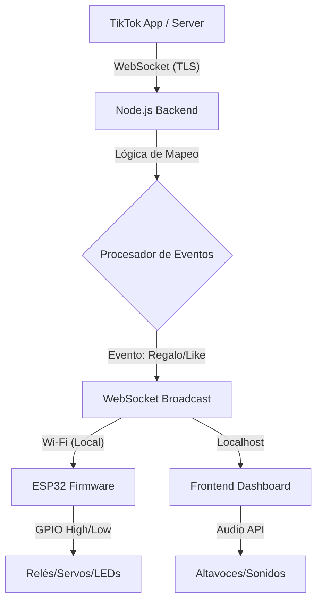

# Arquitectura Técnica - TikTok Live Interactiva

## 1. Visión General
El sistema permite la interacción física y auditiva en tiempo real basada en eventos de TikTok Live. Utiliza una arquitectura orientada a eventos para minimizar la latencia y maximizar la escalabilidad.

## 2. Componentes del Sistema

### A. Backend (Node.js)
- **TikTok Connector**: Utiliza `tiktok-live-connector` para recibir eventos (regalos, likes, chat) mediante WebSockets directamente desde los servidores de TikTok.
- **Event Processor**: Clasifica usuarios, gestiona umbrales y dispara acciones basadas en la configuración.
- **WebSocket Server**: Servidor central que comunica el backend con el Frontend y los dispositivos ESP32.
- **Audio Manager**: Módulo para la reproducción de sonidos locales o mediante el navegador.

### B. Frontend (React + Vite)
- **Dashboard**: Visualización de eventos en tiempo real.
- **Configurador**: Interfaz para mapear eventos a actuadores, definir perfiles y ajustar parámetros.
- **Audio Client**: Reproductor de efectos de sonido sincronizado.

### C. Hardware (ESP32)
- **WebSocket Client**: Se conecta al backend para recibir comandos de activación instantánea.
- **Actuator Controller**: Maneja los pines GPIO para activar relés, servos, LEDs, etc.

## 3. Diagrama de Flujo de Datos

## 4. Clasificación de Usuarios
- **Seguidor**: Usuario que acaba de seguir o ya sigue.
- **Fan**: Usuario con insignia de fan (envío de regalos pequeños o interacción constante).
- **Súper Fan**: Usuarios con insignias de alto nivel o donadores recurrentes.

## 5. Estrategia de Baja Latencia (<1s)
- Uso de WebSockets en toda la cadena de comunicación.
- Procesamiento asíncrono no bloqueante en Node.js.
- Comandos binarios o JSON ligeros para el ESP32.
- Conexión local Wi-Fi para evitar saltos innecesarios a la nube.

---

# Backlog Priorizado

## Fase 1: MVP (Prototipo Funcional)
1. Configuración de entorno Node.js y conexión básica a TikTok Live.
2. Implementación de servidor WebSocket para comunicación con ESP32.
3. Firmware base para ESP32 (conexión Wi-Fi y control de LED/Relé).
4. Mapeo básico: Regalo -> Activar Actuador.

## Fase 2: Configuración y Audio
5. Interfaz web para configuración de mapeos.
6. Sistema de reproducción de audio asociado a eventos.
7. Persistencia de perfiles de configuración (JSON/LocalDB).

## Fase 3: Gamificación y Clasificación
8. Lógica de clasificación de espectadores (Seguidor/Fan/Súper Fan).
9. Módulo de metas colectivas (ej: Meta de 1000 corazones).
10. Mini-juego de ruleta de regalos.

## Fase 4: Escalabilidad y Pulido
11. Soporte para múltiples ESP32 simultáneos.
12. Dashboard avanzado con estadísticas en tiempo real.
13. Optimización final de latencia y manejo de errores de conexión.
