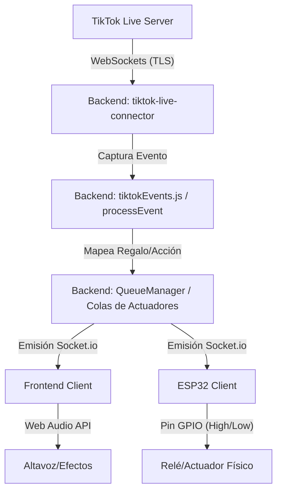

# 🧠 Contexto de Desarrollo y Arquitectura Técnica para IA
Este documento proporciona a cualquier Modelo de Lenguaje / IA una guía exhaustiva sobre la arquitectura, el flujo de datos y el stack tecnológico del proyecto **TikTok Live Interactive System**. Úsalo para comprender el sistema a nivel profundo y proponer refactorizaciones, nuevas integraciones o cambios con máxima precisión.

---

## 🚀 1. Stack Tecnológico

### Backend (Node.js)
* **Runtime**: Node.js
* **Framework Web**: Express (puerto `3000` por defecto).
* **Comunicación en Tiempo Real**: Socket.io (usado para la comunicación bidireccional entre el Backend, la interfaz web del Frontend y los dispositivos hardware ESP32).
* **Conexión con TikTok**: `tiktok-live-connector` (un cliente WebSockets no oficial de TikTok para leer eventos en tiempo real sin requerir APIs privadas).
* **Administrador de Cuentas**: `AccountPool` que gestiona múltiples cuentas y perfiles cargados desde la persistencia local.

### Frontend (React)
* **Herramientas de Construcción**: Vite + React.
* **Estilos**: Tailwind CSS + Iconos de Lucide React.
* **Cliente en Tiempo Real**: `socket.io-client` para la escucha e interacción inmediata con el servidor backend.
* **Generación de Audio**: Web Audio API (evita el almacenamiento de archivos de audio locales en el cliente y previene problemas de CORS al sintetizar ondas en tiempo real).

### Hardware (ESP32)
* **Lenguaje**: C++ (entorno Arduino).
* **Conectividad**: WiFi local + Cliente WebSockets (`WebSocketsClient` y `ArduinoJson`).
* **Hardware controlado**: Servos, relés (para activar dispositivos físicos), luces LED direccionables o LEDs de estado.

---

## 🏗️ 2. Flujo e Hilos de Comunicación

El sistema opera bajo un flujo de datos asíncrono para garantizar una latencia inferior a 1 segundo (<1s):



### Protocolo de Mensajería WebSocket (Socket.io)
Los canales principales de comunicación son:
* **`connection_status`**: Informa sobre el estado de la conexión a TikTok (ej. `connected`, `error`).
* **`live_gift` / `live_chat`**: Datos crudos normalizados que el frontend utiliza para la visualización del chat e histórico de regalos en tiempo real.
* **`esp32_command`**: Comandos JSON de ejecución física dirigidos a los ESP32 con formato:
  ```json
  {
    "action": "relay_1",
    "duration": 1500
  }
  ```
* **`config_update`**: Payload de configuración del sistema sincronizada dinámicamente entre cliente y servidor.

---

## 📂 3. Estructura del Código Fuente y Responsabilidades

### Backend
1. **`backend/index.js`**: Punto de entrada del servidor. Inicializa Express, Socket.io, las rutas y el cargador de cuentas.
2. **`backend/configManager.js`**: Carga y escribe la configuración global del sistema en el archivo persistente local `backend/config.json`.
3. **`backend/accountPool.js`**: Administra los nombres de usuario y los perfiles de conexión de TikTok para admitir sesiones concurrentes o reconexión rápida.
4. **`backend/connectionOrchestrator.js`**: Orquesta y monitoriza las conexiones de TikTok activas e inicia el bucle de salud (*health loop*).
5. **`backend/queueManager.js`**: Implementa una **cola asíncrona no bloqueante**. Si entran múltiples regalos seguidos, los encola para que el ESP32 no colapse y ejecute cada acción con su respectivo `duration`.
6. **`backend/tiktokConnection.js`**: Maneja el ciclo de vida de `WebcastPushConnection` y mapea los eventos del socket (`gift`, `like`, `chat`, `share`, `follow`).
7. **`backend/tiktokEvents.js`**: Lógica de normalización y procesamiento. Determina qué regalo o acción física corresponde a un evento según la configuración del archivo `config.json`.
8. **`backend/routes.js` y `backend/socketManager.js`**: Exponen los endpoints HTTP y configuran los listeners de eventos para Socket.io.

### Frontend
1. **`frontend/src/socket.js`**: Configura y exporta el cliente WebSocket de forma dinámica adaptándose a entornos locales o de desarrollo en red.
2. **`frontend/src/App.jsx`**:
   * **Dashboard interactivo**: Renderizado en tiempo real de eventos, logs y estados.
   * **Configurador de Eventos**: Permite al usuario mapear eventos (likes, regalos específicos) a actuadores específicos con su tiempo de activación en milisegundos.
   * **Generador de Audio**: Motor de audio sintetizado basado en el oscilador nativo del navegador.

---

## 📜 4. Reglas Críticas para Modificaciones

Cuando propongas cambios técnicos, respeta estrictamente estas reglas arquitectónicas:

1. **Persistencia en JSON Local**: La configuración del sistema (tanto mapeos como cuentas) debe persistirse en `backend/config.json`. No uses bases de datos complejas a menos que el usuario lo solicite explícitamente.
2. **Optimistic UI en el Frontend**: Las actualizaciones de configuración web deben aplicarse inmediatamente en el estado de React (para respuesta táctil inmediata del usuario) y enviarse con un *Debounce* al backend para evitar saturación de red.
3. **Mapeos Flexibles de TikTok**: Los regalos de TikTok pueden mapearse por **Nombre exacto** (ej. *"Rose"*) o por **Valor en Monedas** (rango de diamantes). Al modificar `tiktokEvents.js`, asegúrate de que ambos esquemas se respeten.
4. **Manejo Seguro del Hardware (ESP32)**: Los comandos enviados al ESP32 por WebSockets no deben superar la memoria RAM del controlador. Asegura cargas útiles JSON concisas y no bloqueantes.
5. **Evitar Dependencias Externas de Audio**: Si agregas alertas acústicas en el Frontend, hazlo mediante síntesis utilizando la **Web Audio API** en lugar de cargar archivos estáticos externos.
